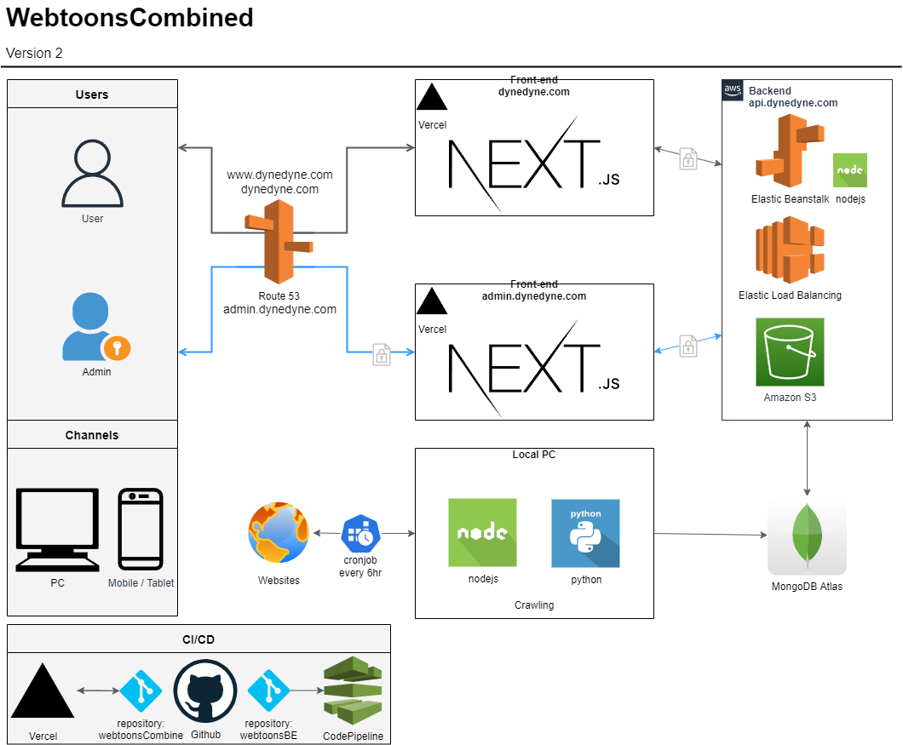

# Webtoons Combined

Webtoons Combined is a webtoon metasearch engine. Webtoons Combined allows users to search and compare webtoon rates in one search. It also provides an aggregated summary of webtoon reviews and ratings from external sites.

## stack



## Features

- Crawl webtoons from websites
- Filter by genre, platform, age, updated date, etc
- Search by title and author
- Every webtoons linked to Official website
- Signup, Login with DB & oAuth
- Comment, Like, dislike, bookmark, watchHistory

## Get started

1. git clone
2. yarn install
3. touch .env
4. Connect to Backend[webtoonsCombinedBE](https://github.com/DynePark9111/webtoonsBE)
5. yarn dev

## .env

1. get MONGODB_URI [MongoDB](https://cloud.mongodb.com/)

2. get keys from reCaptcha [reCaptcha v3](https://www.google.com/recaptcha/about/)

3. get ID and SECRET for oAuth[oAuth](https://next-auth.js.org/providers/)
   - [Naver](https://developers.naver.com/docs/login/api/api.md)
   - [Facebook](https://developers.facebook.com/apps/)
   - [Twitter](https://developer.twitter.com/en/apps)
   - [Google](https://console.developers.google.com/apis/credentials)
   - [Kakao](https://developers.kakao.com/docs/latest/en/kakaologin/common)
4. edit .env
   - ...
     X=[NAVER, FACEBOOK, GOOGLE, TWITTER, KAKAO]
   - X_KEY=`X_CLIENT_ID`
   - X_URI=`X_CLIENT_SECRET`

### .env file
```
- NEXT_PUBLIC_COMPANY=
- NEXT_PUBLIC_URL=
- MONGODB_URI=
- NEXT_PUBLIC_RECAPTCHA_SITE=
- RECAPTCHA_SECRET=
- GOOGLE_CLIENT_ID=
- GOOGLE_CLIENT_SECRET=
- NAVER_CLIENT_ID=
- NAVER_CLIENT_SECRET=
- FACEBOOK_CLIENT_ID=
- FACEBOOK_CLIENT_SECRET=
- TWITTER_CLIENT_ID=
- TWITTER_CLIENT_SECRET=
- KAKAO_CLIENT_ID=
- KAKAO_CLIENT_SECRET=
```
